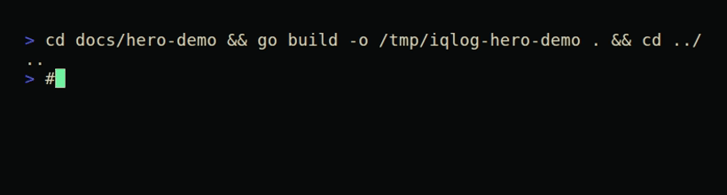
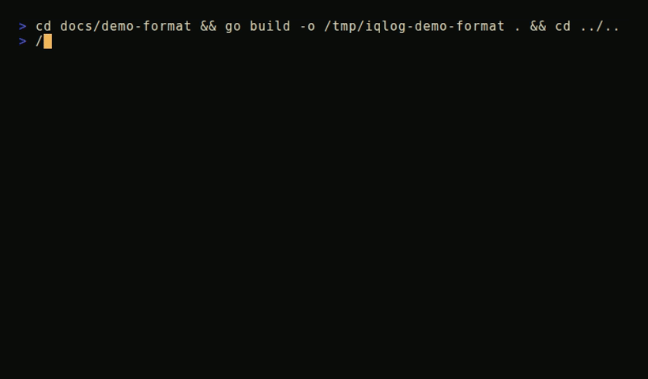
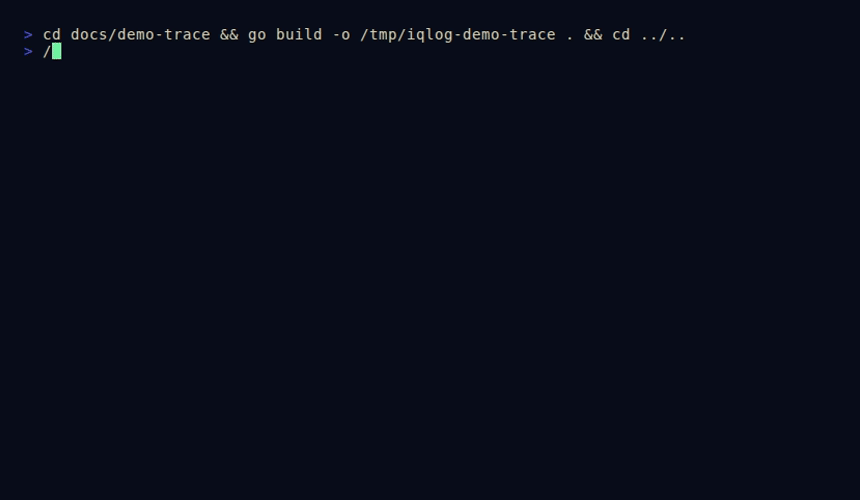
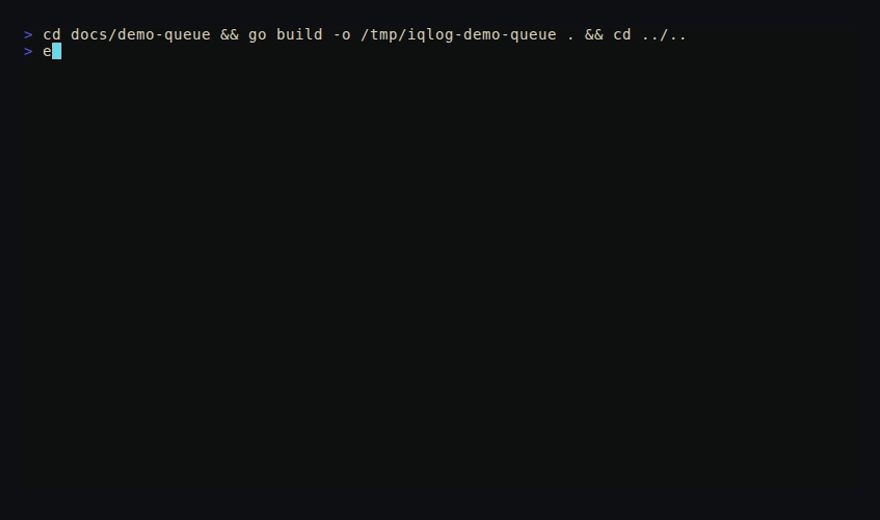

# iqlog

Fast, low-allocation structured logging for Go.

`iqlog` provides a small configuration-driven logger, fluent typed events,
console and newline-delimited JSON output, optional caller and context fields,
and synchronous or buffered writers. The common disabled and typed structured
paths are designed to remain allocation-free.

> Requires Go 1.25 or newer.



<!-- VCR: HERO
Render brief: "Signal Acquisition"
Source tape: docs/hero.tape

Canvas and timing:
- 92 columns by 24 rows, monospace, approximately 12 seconds, 15 fps.
- Use a near-black CRT background (#090b0a), warm ivory text (#d8d1b5), phosphor
  green (#72f1a1), amber (#f1b85b), and restrained error red (#ff6b6b).
- Add subtle scanlines, mild corner falloff, a one-pixel vertical roll at the
  midpoint, and occasional horizontal chromatic displacement. Keep all text
  readable. No fake browser chrome.

Storyboard:
1. Begin with two seconds of tape snow. A block cursor blinks in the upper-left.
   The tracking label "CH 03  IQLOG // INPUT" resolves one character at a time
   in the upper-right, while "SP" and a counter "00:00:00" appear along the
   bottom edge.
2. Type `$ go get github.com/iqhive/iqlog` at human speed. On Enter, let the line
   jump upward as if the VCR tracking briefly slips.
3. Type a compact Go event over three lines:
     log.InfoEvent().
         Str("service", "checkout").Int("port", 8080).
         Msg("ready")
   Highlight method names in green, values in amber, and punctuation in ivory.
4. Split the terminal vertically with a noisy wipe. Keep source code on the left.
   On the right, assemble this JSON record token by token rather than revealing
   it all at once:
     {"level":"INFO","service":"checkout","port":8080,"message":"ready"}
   Briefly pulse each JSON field as its matching builder method is scanned on
   the left. Draw a thin green signal trace between the pairs.
5. Stamp three labels beneath the record with mechanical VCR OSD jitter:
   "TYPED FIELDS", "0 ALLOCS HOT PATH", and "NDJSON OUTPUT". The allocation
   statement is a design/property label, not a benchmark number.
6. Rewind rapidly: counter digits run backward, lines collapse into static, and
   the first empty frame returns exactly for a seamless loop.

Accessibility and export:
- Do not convey levels through color alone; retain the literal `INFO` label.
- Supply an animated GIF/WebP and a still PNG showing the split source/output
  frame. Suggested alt text: "A retro terminal transforms a typed iqlog event
  into a JSON log record."
-->

## Why iqlog?

- **Typed structured events:** append strings, numbers, booleans, errors, times,
  durations, bytes, and raw JSON without reflection on common paths.
- **Human or machine output:** use compact colored console records locally and
  newline-delimited JSON in production.
- **Low hot-path overhead:** typed enabled events and disabled events are covered
  by allocation regression tests.
- **Explicit configuration:** construct independent loggers from a `Config` and
  pass them where they are needed.
- **Flexible delivery:** write synchronously, queue records asynchronously, and
  choose whether a full queue blocks, drops, or falls back to a direct write.
- **Production lifecycle:** flush accepted records, observe dropped records and
  writer errors, and close background workers cleanly.
- **Incremental adoption:** package-level helpers and compatibility adapters are
  available while applications move toward explicit logger dependencies.

## Installation

```bash
go get github.com/iqhive/iqlog
```

Import the package:

```go
import "github.com/iqhive/iqlog"
```

## Quick Start

Create a logger and emit a normal message plus a typed event:

```go
package main

import (
	"os"

	"github.com/iqhive/iqlog"
)

func main() {
	log := iqlog.MustNew(iqlog.Config{
		Format:      iqlog.FormatConsole,
		Level:       iqlog.LevelInfo,
		Writer:      os.Stdout,
		IncludeTime: true,
	})

	log.Info("service started")
	log.InfoEvent().
		Str("service", "checkout").
		Int("port", 8080).
		Bool("tls", true).
		Msg("listening")
}
```

Console output resembles:

```text
[2026-08-29T14:03:12.481902] INFO service started
[2026-08-29T14:03:12.481947] INFO service=checkout port=8080 tls=true listening
```

`Config{}` is valid. It creates a synchronous console logger that writes to
`os.Stderr` at info level. `MustNew` is convenient for static startup
configuration; use `New` when configuration or writer setup errors should be
returned normally:

```go
log, err := iqlog.New(iqlog.Config{Writer: os.Stdout})
if err != nil {
	return err
}
```

## JSON Logging

Select `FormatJSON` for one JSON object per line. JSON timestamps are opt-in:
the zero value omits the timestamp, so set `JSONTimeMode` to opt in.

```go
log := iqlog.MustNew(iqlog.Config{
	Format:       iqlog.FormatJSON,
	Writer:       os.Stdout,
	JSONTimeMode: iqlog.JSONTimeUTC,
})

log.InfoEvent().
	Str("request_id", "req-7f3a").
	Int("status", 200).
	Duration("elapsed", 18*time.Millisecond).
	Msg("request complete")
```

```json
{"time":"2026-08-29T14:03:12.481947Z","level":"INFO","request_id":"req-7f3a","status":200,"elapsed":"18ms","message":"request complete"}
```

Omit the timestamp when another system adds them (this is the default):

```go
log := iqlog.MustNew(iqlog.Config{
	Format: iqlog.FormatJSON,
	Writer: os.Stdout,
})
```

For a custom JSON timestamp layout, opt into `JSONTimeCustom` explicitly:

```go
log := iqlog.MustNew(iqlog.Config{
	Format:          iqlog.FormatJSON,
	Writer:          os.Stdout,
	JSONTimeMode:    iqlog.JSONTimeCustom,
	TimestampLayout: time.RFC3339Nano,
})
```

`JSONTimeUTC` uses the fixed-width UTC fast path.



<!-- VCR: CONSOLE_TO_JSON
Render brief: "Format Switch"
Source tape: docs/console_to_json.tape

Canvas and timing:
- 100 columns by 28 rows, 10 to 14 seconds, 12 fps, seamless loop.
- Present a physical-looking monochrome monitor frame with a small `FORMAT A/B`
  indicator, tape counter, and blinking red REC dot. Use green for console mode,
  cyan for JSON mode, amber for commands, and white for values.

Storyboard:
1. Open on `FORMAT A // CONSOLE`. Type `go run ./cmd/demo` and print four records:
   DBUG cache=warm cache probe
   INFO port=8080 listening
   WARN remaining=2 connection pool low
   ERRR error=timeout upstream failed
   Reveal records with slight line bloom and retain literal level names.
2. Freeze-frame on the `WARN` record. Draw thin boxes around `remaining=2` and
   `connection pool low`, then label them `FIELD` and `MESSAGE` in small OSD text.
3. Simulate pressing a deck's INPUT button. The whole image bends horizontally,
   the label changes to `FORMAT B // JSON`, and the same four semantic records
   redraw as valid single-line JSON objects. Keep key order stable: time, level,
   fields, message.
4. Sweep a scanner from left to right across one JSON line. As it passes, briefly
   annotate `LEVEL`, `TYPED VALUE`, and `MESSAGE`; emphasize that the integer `2`
   is unquoted.
5. Flash `ONE EVENT // TWO ENCODINGS` for one second. Trigger a VHS rewind with
   diagonal noise bars and land on the exact first console frame.

Export notes:
- The JSON must be syntactically valid and must remain on one visual line; widen
  the canvas instead of wrapping it.
- Produce a still at the half-switched frame where console is on the left and
  JSON is on the right. Suggested alt text: "The same iqlog events switch from
  readable console lines to structured JSON records."
-->

## Logging API

Every level is available as a `Logger` method and as a package function:

| Level | Message | Formatted | Println-style | Event |
| --- | --- | --- | --- | --- |
| Trace | `Trace` | `Tracef` | `Traceln` | `TraceEvent` |
| Debug | `Debug` | `Debugf` | `Debugln` | `DebugEvent` |
| Info | `Info` | `Infof` | `Infoln` | `InfoEvent` |
| Warn | `Warn` | `Warnf` | `Warnln` | `WarnEvent` |
| Error | `Error` | `Errorf` | `Errorln` | `ErrorEvent` |
| Panic | `Panic` | `Panicf` | `Panicln` | `PanicEvent` |
| Fatal | `Fatal` | `Fatalf` | `Fatalln` | `FatalEvent` |

Dynamic-level calls use `Log`, `Logf`, and `Logln`:

```go
level, err := iqlog.ParseLevel(os.Getenv("LOG_LEVEL"))
if err != nil {
	level = iqlog.LevelInfo
}

log := iqlog.MustNew(iqlog.Config{Level: level})
log.Log(level, "configured logging")
```

`Print`, `Printf`, and `Println` log at info level. `ParseLevel` accepts `trace`,
`debug`, `info`, `warn`, `warning`, `error`, `panic`, and `fatal` without regard
to case. `Level` implements text marshaling and unmarshaling.

### Expensive Values

Check `Enabled` before performing work that is expensive regardless of whether
the eventual event is discarded:

```go
if log.Enabled(iqlog.LevelDebug) {
	log.DebugEvent().
		RawJSON("snapshot", buildDiagnosticSnapshot()).
		Msg("scheduler state")
}
```

Level-specific event constructors return `nil` when disabled. Event methods are
nil-safe, so an ordinary typed chain can be written directly; the explicit guard
is for avoiding argument computation.

### Panic And Fatal

`Panic`, `Panicf`, and `PanicEvent` write and then panic. `Fatal`, `Fatalf`, and
`FatalEvent` flush accepted records and invoke `Config.ExitFunc(1)`, which is
`os.Exit` by default. Panic and fatal retain their termination behavior even when
their record is filtered by the configured level.

Inject an exit function in tests rather than terminating the test process:

```go
log := iqlog.MustNew(iqlog.Config{
	Writer: io.Discard,
	ExitFunc: func(code int) {
		exitCode = code
	},
})
```

## Structured Events

An event is a single-use builder. Add fields and finish it with `Msg`, `Msgs`, or
`Msgf`:

```go
log.ErrorEvent().
	Err(err).
	Str("operation", "charge").
	Int64("account_id", accountID).
	Float64("amount", 49.95).
	Msg("payment failed")
```

Available field methods:

| Method | Encoded value |
| --- | --- |
| `Str`, `Stringer` | String |
| `Int`, `Int64` | Signed decimal integer |
| `Uint`, `Uint64` | Unsigned decimal integer |
| `Float32`, `Float64` | JSON number; non-finite values become JSON strings |
| `Bool` | Boolean |
| `Err` | Error text under the `error` key |
| `Time` | RFC 3339 timestamp with nanoseconds when needed |
| `Duration` | Go duration string such as `250ms` |
| `Bytes` | Base64-encoded bytes |
| `RawJSON` | Pre-encoded JSON value |
| `Any` | Common concrete fast paths, then generic encoding |

Prefer typed methods to `Any` in hot paths. `Any` handles primitive and common
types directly, but uncommon values can use `encoding/json`, reflection, or
formatting and may allocate.

`RawJSON` validates its input. Invalid input is emitted as `null`, and the event
reports the problem through `BuildError` before it is consumed:

```go
event := log.InfoEvent().RawJSON("payload", payload)
if err := event.BuildError(); err != nil {
	event.Discard()
	return err
}
event.Msg("payload accepted")
```

`Discard` consumes an unfinished non-terminal event without writing it. Once an
event is finished or discarded, further calls are ignored. Events must not be
shared between goroutines.

### Field Names

The reserved event keys `time`, `level`, `message`, `func`, and `file` are
automatically prefixed with `field_` when supplied as user fields. This preserves
the record envelope: a user field can never overwrite it.

The prefixing is not injective. A record that carries both `time` and an
explicit `field_time` emits the key `field_time` twice, and a JSON parser keeps
only one of the two values. Closing that would mean prefixing every name that
already begins with `field_`, which costs about 3% of a three-field record and
renames keys that are not reserved at all. Duplicate keys are reachable without
the escape anyway -- nothing stops `Str("x", 1).Str("x", 2)` -- so if you log
reserved names, avoid `field_`-prefixed ones alongside them.

Field names are always safe to pass untrusted input. Keys are scanned on the
way out and escaped whenever they contain a quote, a backslash, a control
character, or a non-ASCII byte, so a hostile key cannot break out of the JSON
string and forge fields. The scan is a single allocation-free pass, and the
plain append path is still used for the identifier-style keys that dominate
real workloads.

`EscapeFieldNames` forces escaping for every key, skipping that scan. It is not
needed for correctness:

```go
log := iqlog.MustNew(iqlog.Config{
	Format:           iqlog.FormatJSON,
	Writer:           os.Stdout,
	EscapeFieldNames: true,
})
```

Field *values* and messages are always escaped, and bytes that are not valid
UTF-8 are replaced with U+FFFD so records stay parseable by strict JSON readers.

## Persistent Fields

`WithFields`, `WithError`, and `WithContext` return logger copies. The copies
share the original writer lifecycle and immutable configuration snapshot.

```go
serviceLog := log.WithFields(map[string]any{
	"service": "billing",
	"region":  "eu-west-1",
})

serviceLog.Info("worker started")
serviceLog.WithError(err).Error("job failed")
```

Fields from maps are emitted deterministically. A later `WithFields` call
replaces an existing persistent field with the same key.

## Context Fields

Configure one extractor to map application-specific context values into fields:

```go
type contextKey string

const requestIDKey contextKey = "request-id"

log := iqlog.MustNew(iqlog.Config{
	Format: iqlog.FormatJSON,
	Writer: os.Stdout,
	ContextExtractor: func(ctx context.Context) map[string]any {
		fields := make(map[string]any, 1)
		if requestID, ok := ctx.Value(requestIDKey).(string); ok {
			fields["request_id"] = requestID
		}
		return fields
	},
})

ctx := context.WithValue(context.Background(), requestIDKey, "req-7f3a")
log.LogContext(ctx, iqlog.LevelInfo, "request accepted")
```

Use `LogContextf` for formatting, or carry a context on a logger copy:

```go
requestLog := log.WithContext(ctx)
requestLog.InfoEvent().Int("status", 201).Msg("response sent")
```

The extractor runs once for each enabled context-aware record. Explicit context
passed to `LogContext` takes precedence over context stored with `WithContext`.
Context extraction is optional work, so it is not performed unless configured.



<!-- VCR: CONTEXT_TRACE
Render brief: "Request Signal Trace"
Source tape: docs/context_trace.tape

Canvas and timing:
- 108 columns by 30 rows, approximately 16 seconds, 15 fps.
- Use a midnight-blue CRT background, pale blue source text, green request IDs,
  amber status codes, and red only for the simulated failure. Add sparse static
  and a soft phosphor persistence trail when lines move.

Storyboard:
1. Show a compact HTTP handler on the left and an empty log monitor on the right.
   The handler should visibly call `log.LogContext(ctx, iqlog.LevelInfo, ...)` and
   later `log.WithContext(ctx).InfoEvent().Int("status", 200)...`.
2. A simulated request enters at the top as a packet-shaped ASCII box labeled
   `GET /orders/42` and `x-request-id: req-7f3a`. Animate the packet descending
   through three nodes: `middleware`, `handler`, and `writer`.
3. At `middleware`, the request ID separates into a glowing green token and moves
   into a small box labeled `context.Context`. Show the `ContextExtractor` reading
   the token exactly once; represent this with a single sweep, not a loop.
4. As the packet reaches `handler`, print two JSON records on the right. Both must
   carry `"request_id":"req-7f3a"`; the second also carries numeric `"status":200`.
   Connect the same request ID in both records with a vertical green trace.
5. Introduce a second packet `req-b912` below it and interleave one record from
   each request. Then isolate each trace with separate thin outlines to show that
   context correlation survives interleaving.
6. Briefly change the first request's final event to an error record with
   `"error":"upstream timeout"`. Pulse `ERROR` twice in red, but leave its
   request ID green and readable.
7. Display `CONTEXT IN // CORRELATED FIELDS OUT`, then simulate tracking loss.
   Packets rise in reverse order and return to the initial empty monitor.

Accuracy constraints:
- Never imply that iqlog creates request IDs or tracing spans; the animation must
  show the application/middleware placing a value in context and the configured
  extractor mapping it to a field.
- Suggested alt text: "Two interleaved requests retain distinct request IDs in
  context-enriched iqlog records."
-->

## Caller Information

Set `CallerDepth` to include function and file information. Caller lookup is
disabled by default because it has a cost.

```go
log := iqlog.MustNew(iqlog.Config{
	Format:      iqlog.FormatJSON,
	Writer:      os.Stdout,
	CallerDepth: 1,
})
```

JSON records receive `func` and `file` keys. Console records show caller data in
brackets. For adapters that already know the original call site, `EventAt`
accepts explicit function and file strings:

```go
log.EventAt(iqlog.LevelWarn, "worker.run", "worker.go:84").
	Str("queue", "email").
	Msg("retrying job")
```

Pass empty caller strings to `EventAt` to suppress caller output for that event.

## Color And Timestamps

Console colors are detected automatically for terminal writers. Control the
behavior explicitly with `Color` or `DisableColor`:

```go
log := iqlog.MustNew(iqlog.Config{
	Writer:       os.Stdout,
	Color:        true,
	DisableColor: false,
})
```

`DisableColor` wins when both fields are true. Redirected output is not colored
unless `Color` is forced.

Console timestamps are opt-in through `IncludeTime`. `TimestampLayout` accepts a
normal Go time layout or one of these convenience names:

| Name | Precision |
| --- | --- |
| `seconds` | Seconds |
| `milliseconds` | Milliseconds |
| `microseconds` | Microseconds |
| `nanoseconds` | Nanoseconds |

```go
log := iqlog.MustNew(iqlog.Config{
	Writer:          os.Stdout,
	IncludeTime:     true,
	TimestampLayout: "milliseconds",
})
```

`Config.Now` can inject a clock for deterministic tests.

## Package-Level Logger

Package functions route through `Default()`:

```go
iqlog.Info("using the package logger")
iqlog.WarnEvent().Str("component", "cache").Msg("eviction pressure")
```

Install an application logger atomically during startup:

```go
log := iqlog.MustNew(iqlog.Config{
	Format: iqlog.FormatJSON,
	Level:  iqlog.LevelInfo,
	Writer: os.Stdout,
})
iqlog.SetDefault(log)
```

`SetDefault` does not close the previous logger. If the previous logger uses a
background writer and is no longer needed, retain it and close it explicitly.
For libraries, prefer accepting a concrete logger or a small consumer-defined
interface instead of mutating the process-wide default.

## Writer Modes

The default `WriterSync` mode formats and writes on the calling goroutine. It is
the simplest choice and preserves immediate writer errors.

For slower destinations, queue complete records with `WriterAsync`:

```go
log := iqlog.MustNew(iqlog.Config{
	Format:         iqlog.FormatJSON,
	Writer:         os.Stdout,
	WriterMode:     iqlog.WriterAsync,
	BufferSize:     4096,
	OverflowPolicy: iqlog.OverflowBlock,
})
defer log.Close()
```

`BufferSize` is a record count and defaults to 1000 when zero.

### Overflow Policies

| Policy | Full-queue behavior | Tradeoff |
| --- | --- | --- |
| `OverflowBlock` | Wait for queue capacity | No intentional loss; caller latency can increase |
| `OverflowDrop` | Reject the new record | Bounded caller latency; records can be lost |
| `OverflowSync` | Drain accepted records, then write directly | Avoids loss while temporarily moving I/O to the caller |

With `OverflowDrop`, inspect the cumulative rejected-record count:

```go
if dropped := log.Dropped(); dropped != 0 {
	fmt.Fprintf(os.Stderr, "iqlog dropped %d records\n", dropped)
}
```

`WriterRing` is a compatibility mode backed by the same channel queue as
`WriterAsync`. Its default overflow behavior is `OverflowSync`; it is not a
distinct lock-free ring implementation.

By default, synchronous writes are serialized so an ordinary `io.Writer` does
not receive concurrent calls. Set `ConcurrentWriter` only when the destination
explicitly supports concurrent writes.



<!-- VCR: ASYNC_QUEUE
Render brief: "Buffer Under Pressure"
Source tape: docs/async_queue.tape

Canvas and timing:
- 112 columns by 32 rows, 18 seconds, 15 fps. Dark charcoal CRT, ivory labels,
  green accepted records, amber waiting records, red dropped records, cyan for
  the writer head. Include a top-right mode label and bottom tape counter.

Layout:
- Left: producers `G1`, `G2`, and `G3`, each emitting numbered record capsules.
- Center: an eight-slot horizontal queue labeled `BUFFER SIZE = 8`.
- Right: a deliberately slow writer represented by a tape head consuming one
  capsule at a time. Below it, counters for `ACCEPTED`, `WRITTEN`, and `DROPPED`.

Storyboard:
1. Start in `WRITER ASYNC // OVERFLOW BLOCK`. Three producers push records into
   the queue. The writer consumes more slowly until all slots fill. Producers
   stop at the queue boundary with amber `WAIT` tags; no records disappear.
2. Hit a noisy pause frame. Change only the policy label to `OVERFLOW DROP` and
   reset counters. Repeat the same burst. New records that meet a full queue
   break into red static at the boundary while `DROPPED` increments exactly once
   per rejected record. Existing queued records continue toward the writer.
3. Pause again and switch to `OVERFLOW SYNC`. Repeat the burst. When full, draw a
   cyan bypass track from the producer to the writer, but first animate the queue
   draining so record order remains visually intact. Label the bypass `CALLER
   WRITES AFTER ACCEPTED RECORDS`.
4. End each policy segment with a short `Flush()` command. A vertical sync pulse
   travels from the queue tail to the writer; only after the final accepted
   record is consumed should the prompt return.
5. Finish on a three-column comparison card: `BLOCK = WAIT`, `DROP = COUNT LOSS`,
   `SYNC = CALLER I/O`. Rewind the capsules and counters to the initial state.

Accuracy constraints:
- Do not depict `WriterRing` as lock-free or as a circular overwrite buffer.
- `OverflowSync` must not visually overtake already accepted queued records.
- Suggested alt text: "An eight-slot asynchronous log queue demonstrates block,
  drop, and synchronous fallback overflow policies."
-->

## Native System Logs

Set `NativeLog` to route records to the platform-native system log instead of
an `io.Writer`: Apple's unified logging (`os_log`) on macOS and the Windows
Event Log (Application log) on Windows. Records keep their severity, so they
filter correctly in Console.app / `log stream` and Event Viewer.

```go
log := iqlog.MustNew(iqlog.Config{
	ApplicationName: "myapp", // os_log subsystem / event source name
	NativeLog:       true,
})
defer log.Close()
```

`NativeLog` takes precedence over `Writer` and `SyslogHost`, works with every
`WriterMode`, and is fully opt-in: when it is off, the default path does no
native-log work. On other platforms, and on macOS builds with
`CGO_ENABLED=0`, `New` returns an error.

Platform notes:

- **macOS:** messages are logged with the `%{public}s` privacy marker so they
  are not redacted as `<private>`. Browse them with
  `log stream --predicate 'subsystem == "myapp"'`.
- **Windows:** register the source once with administrator privileges so
  records render without a "description cannot be found" notice:

  ```go
  err := iqlog.InstallEventLogSource("myapp") // remove with RemoveEventLogSource
  ```

## Flush, Errors, And Shutdown

`Flush` waits until all accepted queued records have been processed. It returns
writer and overflow errors accumulated since the previous flush:

```go
if err := log.Flush(); err != nil {
	fmt.Fprintf(os.Stderr, "flush logs: %v\n", err)
}
```

`LastWriteError` is a sticky diagnostic containing the most recent output error.
Unlike `Flush`, reading it does not clear it. Asynchronous background errors are
reported through both mechanisms.

`Close` drains background workers and is idempotent. It does not close the
caller-owned underlying writer. After close, `Enabled` returns false and
operations such as `Flush` or `SetConfig` return `ErrClosed`.

```go
log, err := iqlog.New(iqlog.Config{
	Writer:     file,
	WriterMode: iqlog.WriterAsync,
})
if err != nil {
	return err
}
defer file.Close() // The application owns the file.
defer log.Close()  // The logger owns its worker.
```

Close the logger before its underlying destination. When shutdown error handling
matters, call both explicitly instead of relying only on deferred calls.

## Configuration Reference

| Field | Purpose | Zero-value behavior |
| --- | --- | --- |
| `Format` | Console or JSON encoding | `FormatConsole` |
| `Level` | Minimum emitted level | `LevelInfo` |
| `Writer` | Destination implementing `io.Writer` | `os.Stderr` |
| `ConcurrentWriter` | Skip synchronous writer serialization | `false` |
| `EscapeFieldNames` | Always escape dynamic JSON keys, skipping the safety scan | `false` |
| `IncludeTime` | Include console timestamp | `false` |
| `TimestampLayout` | Console/custom JSON time layout | Microsecond console layout |
| `JSONTimeMode` | Disabled, UTC, or custom JSON timestamp | `JSONTimeDisabled` |
| `CallerDepth` | Capture caller frames | Disabled |
| `Color` | Force ANSI console color | Terminal auto-detection |
| `DisableColor` | Disable forced and automatic color | `false` |
| `ApplicationName` | Application metadata, including syslog and native log setup | Empty |
| `SyslogHost` | Select syslog output | Empty |
| `NativeLog` | Route output to the platform system log (os_log / Event Log) | `false` |
| `ContextExtractor` | Convert context values to fields | Disabled |
| `WriterMode` | Sync, async, or ring compatibility mode | `WriterSync` |
| `BufferSize` | Number of queued records | `1000` |
| `OverflowPolicy` | Full-queue behavior | `OverflowBlock` |
| `ExitFunc` | Fatal termination hook | `os.Exit` |
| `Now` | Timestamp source | `time.Now` |

Prefer constructing a complete `Config` over applying setters one by one. A
complete value makes dependencies explicit and installs a coherent immutable
configuration snapshot. `Config()` returns a copy of the current configuration;
`SetConfig` replaces it and transitions the writer lifecycle safely.

## Record Safety

Logged values routinely carry untrusted input, so the encoders defend the record
envelope by default. No configuration is required.

- **JSON.** Field names, field values, and messages are escaped. Bytes that are
  not valid UTF-8 become U+FFFD, matching `encoding/json`, so strict parsers
  accept every record. `RawJSON` validates its argument and substitutes `null`
  on failure, reporting the problem through `BuildError`.
- **Console.** Control characters in the caller-supplied part of a line are
  escaped: CR and LF (which would otherwise forge additional log lines) become
  `\n` and `\r`, and ESC, backspace, DEL, and the rest of the C0 range become
  `\xNN` so a logged value cannot drive the reader's terminal. The C1 range
  U+0080-U+009F becomes `\u00NN` for the same reason -- U+009B is CSI, which a
  terminal honoring C1 treats exactly like `ESC [`. Tab is left alone, and so
  is ordinary multi-byte text. The record envelope this package generates is
  exempt, which is what keeps its own ANSI color sequences intact.
- **System logs.** NUL bytes are escaped before a record reaches `os_log` or the
  Windows Event Log, where they would otherwise truncate or reject it. Control
  characters in `ApplicationName` are replaced before it is used as the syslog
  tag, which is written into the record header ahead of the message.
- **One record, one line.** `RawJSON` compacts its argument, because valid JSON
  may carry newlines between tokens that would split the record for a
  newline-delimited reader. A raw newline inside a JSON string is not valid
  JSON, so compaction is lossless. It also rejects arguments that are not
  valid UTF-8 -- `encoding/json` does not check that, but JSON text has to be
  UTF-8 -- substituting `null` and reporting the reason through `BuildError`.
  `Any` falls back to escaped text when a custom `MarshalJSON` returns
  ill-formed UTF-8, for the same reason.
- **The envelope too.** Text that reaches the envelope from configuration or
  from an explicit caller is escaped where it is written: a custom
  `TimestampLayout`, and the function and file passed to `EventAt`. The
  whole-line console scan exempts the envelope so this package's own ANSI
  colour sequences survive, which is why those two inputs are handled
  separately.

These checks are not free. Measured on a three-field JSON record, scanning field
names costs about 5 ns (roughly 4%). The console control-byte scan is word-at-a-
time rather than the two `bytes.IndexByte` passes that a CR/LF-only check could
use, which is immaterial for typical records but does show up on very long
console lines. JSON is the production path and is unaffected by the console
scan.

## Writer Serialization

A writer that is not declared `ConcurrentWriter` is serialized on a mutex held
by the logger rather than by its current configuration, so replacing the writer,
switching between sync and async modes, or reconfiguring under load cannot let a
retiring writer and its replacement write to the same destination at once.
Logger copies from `WithFields`, `WithError`, and `WithContext` share that lock
with the original. Separate `Logger` values do not: two loggers pointed at one
destination serialize only if that destination does it itself.

A destination that panics does not take the logger with it. A synchronous
write releases the shared lock on its way out, so the panic reaches the call
site that chose to log and later records still go through. A background write
has no call site to propagate to, so the async writer reports the panic as a
write error through `LastWriteError` and keeps running rather than taking the
host process down.

## Writer Ownership

The logger closes only the writers it opened itself. A syslog connection dialled
from `SyslogHost` is closed when it is replaced or when the logger is closed, and
an async or ring writer is drained and stopped. A writer supplied through
`Config.Writer` or `SetWriter` belongs to the caller and is never closed, so
handing the logger `os.Stderr` or a shared file stays safe.

## Performance Guidance

For predictable hot-path performance:

1. Prefer `Str`, `Int`, `Bool`, and the other typed field methods over `Any`.
2. Leave caller lookup, context extraction, custom timestamps, and color
   disabled unless their information is needed.
3. Guard expensive field construction with `Enabled`.
4. Use async output only when moving destination latency off the caller is worth
   the queue and lifecycle complexity.
5. Benchmark with the same payload, features, writer semantics, and CPU count as
   the alternatives being compared.

The repository includes allocation regression coverage in
`TestHotPathsDoNotAllocate` and comparative benchmarks against `log/slog`,
`zerolog`, and `phuslu/log` in [`bench/`](bench/). Benchmark numbers depend on
hardware, Go version, payload, and writer configuration, so run them in your own
target environment rather than treating checked-in output as a universal claim.

```bash
cd bench
go test -run '^$' -bench . -benchmem -count=5
```

For statistically meaningful comparisons, fix the CPU count for both runs and
compare saved outputs with `benchstat`.

## Migration And Compatibility

New code should use `New(Config)`, `InfoEvent`, `Warn`, and `LogContext`. Common
historical helpers remain as adapters:

| Historical API | Preferred API |
| --- | --- |
| `NewIQLogger(false)` | `New(Config{Format: FormatConsole})` |
| `NewIQLogger(true)` | `New(Config{Format: FormatJSON})` |
| `NewGlobalIQLogger()` | `New(Config{IncludeTime: true, CallerDepth: 1})` |
| `InfoWith()` | `InfoEvent()` |
| `Warning(...)` | `Warn(...)` |
| `SetWriter(w)` | Construct with `Writer: w` or use `SetConfig` |
| `Log(ctx, level, msg)` | `LogContext(ctx, level, msg)` |

The historical context-first `Log(ctx, level, ...)` signature cannot coexist
with `Log(level, ...)` because Go has no function overloading. See
[`MIGRATION.md`](MIGRATION.md) for the complete mapping.

`SetNewLine` is retained as a compatibility no-op. Every record is complete, and
JSON output is always newline-delimited.

## Development

Required validation for changes:

```bash
go test ./...
go vet ./...
go test -race -count=1 ./...
```

Changes affecting event creation, encoding, timestamps, caller capture, writer
submission, or pooling should also run the benchmark suite:

```bash
cd bench
go test -bench . -benchmem -count=5
```

## License

No license file is currently included in this repository. Add one before relying
on the project under specific redistribution terms.
